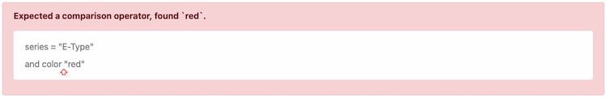

# Use Pimcore Query Language (PQL) as a Developer

## Execute searches based on PQL queries

If you want to use the Pimcore Query Language (PQL) as a developer to search for data in the Pimcore Generic Data Index, you can use one of the following methods:

#### 1. Search Modifier for the Generic Data Index search services

You can use the [PqlFilter](https://github.com/pimcore/generic-data-index-bundle/blob/1.x/src/Model/Search/Modifier/QueryLanguage/PqlFilter.php) search modifier to filter search results based on a PQL query. The `PqlFilter` search modifier can be used with the search services provided by the Generic Data Index bundle. Take a look at the [Search Services](../README.md) documentation for details.

#### 2. Direct use of the PQL processor to get the search query

Use the `Pimcore\Bundle\GenericDataIndexBundle\QueryLanguage\ProcessorInterface` together with the `Pimcore\Bundle\GenericDataIndexBundle\Service\SearchIndex\IndexEntityServiceInterface` to process a PQL query.

```php
// inject both services via Symfony dependency injection
/** @var \Pimcore\Bundle\GenericDataIndexBundle\QueryLanguage\ProcessorInterface $queryLanguageProcessor */
/** @var \Pimcore\Bundle\GenericDataIndexBundle\Service\SearchIndex\IndexEntityServiceInterface $indexEntityService */

$query = $queryLanguageProcessor->process(
    'color = "red" or color = "blue"', // The PQL query
    $indexEntityService->getByEntityName('Car') // 'Asset', 'Document' or the name of the data object class
);

// $query is now a valid OpenSearch query array which can be used to search in the index
```

## Exception Handling

In both cases, the PQL processor will throw an exception if the PQL query is invalid. The exception message will contain detailed information about the error. Especially when you would like to allow users to enter PQL queries, you should catch the exception and provide a user-friendly error feedback. 

##### Example

This example will produce a error message like this:



```php
## Catching the exception
use Pimcore\Bundle\GenericDataIndexBundle\Exception\QueryLanguage\ParsingException;

try {
    $pqlQuery = 'series = "E-Type"
        and color "red"';

    $query = $queryLanguageProcessor->process(
        $pqlQuery, // The PQL query
        $indexEntityService->getByEntityName('Car') // 'Asset', 'Document' or the name of the data object class
    );
} catch (ParsingException $e) {
    // Provide user-friendly error feedback
    return $twig->render('pql-syntax-error.html.twig', [
        'error' => $e->getMessage(),
        'syntaxBeforeError' => substr($e->getQuery(), 0, $e->getPosition()),
        'syntaxAfterError' => substr($e->getQuery(), $e->getPosition()),
    ]);
}
```


```twig
{# pql-syntax-error.html.twig #}

<!doctype html>
<html lang="en">
<head>
    <!-- Bootstrap CSS -->
    <link href="https://cdn.jsdelivr.net/npm/bootstrap@5.0.2/dist/css/bootstrap.min.css" rel="stylesheet" integrity="sha384-EVSTQN3/azprG1Anm3QDgpJLIm9Nao0Yz1ztcQTwFspd3yD65VohhpuuCOmLASjC" crossorigin="anonymous">

    <style>
        .pql-syntax-error {
            line-height: 2em;
        }

        .pql-syntax-error-location {
            position: absolute;
        }

        .pql-syntax-error-location span {
            left: -0.5em;
            position: absolute;
            color: #f44336;
            top: 15px;
        }
    </style>

</head>
<body>
    <div class="container pt-5">
        <div class="alert alert-danger">
            <p><strong>{{ error }}</strong></p>
            <div class="alert alert-light">
                <div class="pql-syntax-error">
                    {{ syntaxBeforeError|nl2br }}<span class="pql-syntax-error-location"><span>⇧</span></span>{{ syntaxAfterError|nl2br }}
                </div>
            </div>
        </div>
    </div>
</body>
</html>
```
