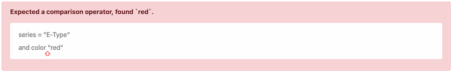

# Use PQL as a Developer

## Execute Searches with PQL

### Option 1: PqlFilter Search Modifier

Use the
[PqlFilter](https://github.com/pimcore/generic-data-index-bundle/blob/2.0/src/Model/Search/Modifier/QueryLanguage/PqlFilter.php)
search modifier with the Generic Data Index search services.
See the [Search Services](../README.md) documentation.

### Option 2: PQL Processor (Direct Query)

Use `ProcessorInterface` together with `IndexEntityServiceInterface`
to process a PQL query directly:

```php
/** @var \Pimcore\Bundle\GenericDataIndexBundle\QueryLanguage\ProcessorInterface $queryLanguageProcessor */
/** @var \Pimcore\Bundle\GenericDataIndexBundle\Service\SearchIndex\IndexEntityServiceInterface $indexEntityService */

$query = $queryLanguageProcessor->process(
    'color = "red" or color = "blue"',
    $indexEntityService->getByEntityName('Car') // 'Asset', 'Document', or data object class name
);

// $query is a valid search index query array
```

## Exception Handling

The PQL processor throws a `ParsingException` for invalid queries.
The exception contains the error details and the position of the syntax error.
Catch this exception to provide user-friendly error feedback, especially when
allowing end users to enter PQL queries.

### Example

This invalid query produces a syntax error:



```php
use Pimcore\Bundle\GenericDataIndexBundle\Exception\QueryLanguage\ParsingException;

try {
    $pqlQuery = 'series = "E-Type"
        and color "red"';

    $query = $queryLanguageProcessor->process(
        $pqlQuery,
        $indexEntityService->getByEntityName('Car')
    );
} catch (ParsingException $e) {
    return $twig->render('pql-syntax-error.html.twig', [
        'error' => $e->getMessage(),
        'syntaxBeforeError' => substr($e->getQuery(), 0, $e->getPosition()),
        'syntaxAfterError' => substr($e->getQuery(), $e->getPosition()),
    ]);
}
```

```twig
{# pql-syntax-error.html.twig #}

<!doctype html>
<html lang="en">
<head>
    <link href="https://cdn.jsdelivr.net/npm/bootstrap@5.0.2/dist/css/bootstrap.min.css"
          rel="stylesheet"
          integrity="sha384-EVSTQN3/azprG1Anm3QDgpJLIm9Nao0Yz1ztcQTwFspd3yD65VohhpuuCOmLASjC"
          crossorigin="anonymous">

    <style>
        .pql-syntax-error {
            line-height: 2em;
        }

        .pql-syntax-error-location {
            position: relative;
        }

        .pql-syntax-error-location span {
            position: absolute;
            left: -0.5em;
            top: 10px;
            color: #f44336;
        }
    </style>
</head>
<body>
    <div class="container pt-5">
        <div class="alert alert-danger">
            <p><strong>{{ error }}</strong></p>
            <div class="alert alert-light">
                <div class="pql-syntax-error">
                    {{ syntaxBeforeError|nl2br }}
                    <span class="pql-syntax-error-location"><span>&#8679;</span></span>
                    {{ syntaxAfterError|nl2br }}
                </div>
            </div>
        </div>
    </div>
</body>
</html>
```
